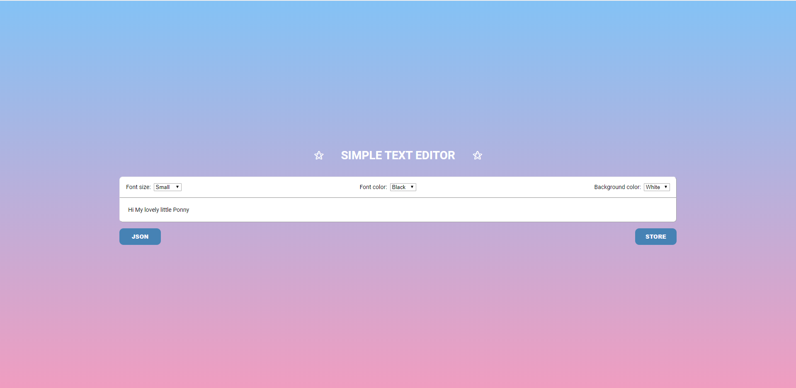

# Тестове завдання у компанію Redentu на позицію Junior React Developer



# Вимоги
```
Технології:
    [X] React.js

Вимоги:
    [X] Додайте можливість редагувати, виділяти текст
    [X] Додайте 3 кнопки для зміни кольору, розміру шрифту та зміни фонового кольору виділеного тексту
    [X] Використайте власні компоненти, реалізуйте передачу даних через emit та props
    [X] Додайте можливість створювати перенос тексту в новий рядок. Повинен створюватись новий <br/>
    [ ] Текст не повинен мати вкладеностей <span> ... <span> ... </span> ... </span>
    [X] Текст не повинен містити додаткових тегів <div> чи <font>
    [ ] Створіть можливість переводити текст в json-формат:
            [X] Виведіть json-запис в окремий блок або консоль
            [X] Масив повинен містити властивості: текстовий блок, його властивості: розмір, колір, фон
            [ ] Основна вимога: cуміжні блоки тексту з однаковими атрибутами (колір, розмір, фон) мають об'єднуватись так, щоб суміжні блоки з однаковими атрибутами не дублювались
    [X] Залийте в Github репозиторій

    Додатково:
        [ ] Сумісність з браузерами IE10, Chrome, FF, Safari останніх версій
        [X] Використання Redux або Vuex
```
